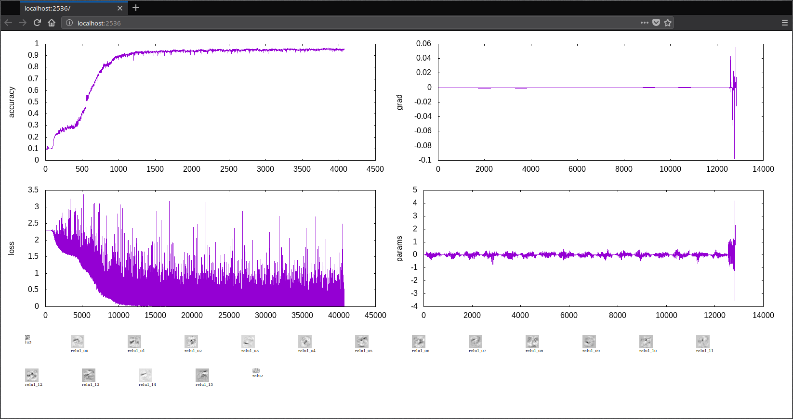

# VectorStream

VectorStream is a from-scratch implementation of a few Artificial Neural Network primitives:

  * Automatic differentiation
  * Gradient descent
  * Linear units
  * Convolutional units
  * Max pooling
  * Dropout
  * Arbitrary activations
  * Softmax classification

E.g. below is the output during training of a network for handwriting recognition on the MNIST data set. In this case, the network `NewNet(LU(10,10), Re(LU(10,16), Re(LU(16,784))))` reaches about 96% accuracy.

 
